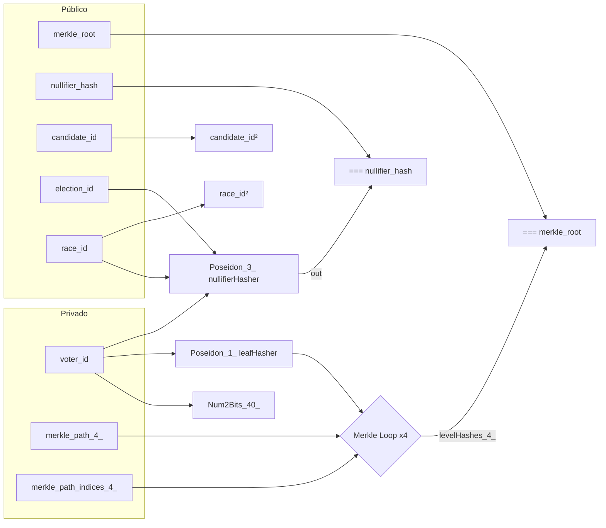
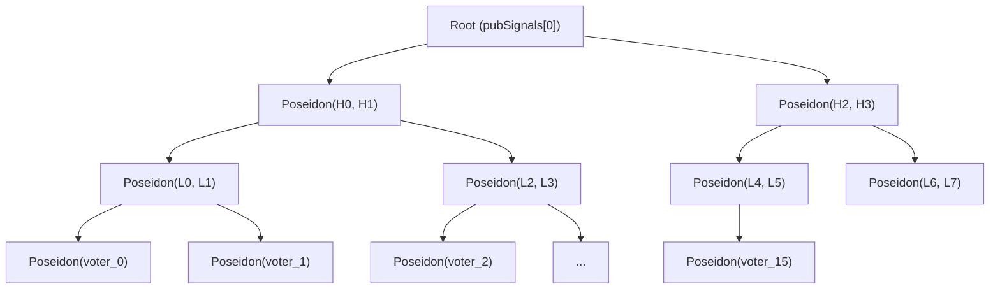

# Arquitetura do Circuito VoterProof

> Documentação técnica da arquitetura do circuito ZK para votação eletrônica anônima verificável.

---

## Visão geral

O circuito `VoterProof(depth=4)` prova três propriedades simultaneamente, sem revelar o `voter_id`:

1. **Autorização** — o eleitor pertence à árvore de Merkle de autorizados
2. **Unicidade** — o nullifier é determinístico, impedindo voto duplo por cargo
3. **Vinculação** — o `race_id` público impede reutilização cross-cargo (relay attack)

---

## Fluxo de sinais



---

## Estrutura da Merkle tree



Profundidade: **4** → suporta até **16 folhas** (15 eleitores + 1 padding zero).

---

## Decisões arquiteturais

### 1. Merkle tree manual (Mux1 + Poseidon)

A `circomlib@2.0.5` **não fornece** um template de prova de Merkle binária — apenas `SMTVerifier` (Sparse Merkle Tree), com interface e semântica diferentes. A implementação manual segue o padrão de:

- **Tornado Cash** — `MerkleTreeWithHistory.circom`
- **Semaphore v2** — `tree.circom`

Ambos usam `Mux1` + `Poseidon(2)` da circomlib auditada, exatamente como este circuito.

### 2. Num2Bits(40) para range check

Sem restrição de intervalo, `voter_id` aceita qualquer elemento do campo BN128 (~2^254). O `Num2Bits(40)` garante que o voter_id cabe em 40 bits (max ~1,1 trilhão), suficiente para CPFs de 11 dígitos.

**Referência:** vulnerabilidade Dark Forest (Daira Hopwood) — campos sem range check permitiram entradas fora do domínio.

### 3. Nullifier com 3 inputs

```
nullifier = Poseidon(voter_id, election_id, race_id)
```

| Input | Justificativa |
|-------|-------------|
| `voter_id` | Vincula o nullifier à identidade (sem revelar) |
| `election_id` | Permite reutilizar o mesmo voter_id em eleições diferentes |
| `race_id` | Permite votar em múltiplos cargos na mesma eleição |

### 4. Dummy constraints

| Sinal | Por que precisa de dummy | Risco sem ele |
|-------|-------------------------|---------------|
| `candidate_id` | Não aparece em nenhuma computação — apenas registrado on-chain | Under-constrained: provador malicioso poderia alterar o candidato |
| `race_id` | Já constrangido via nullifier, mas mantido como defesa em profundidade | Redundante, porém custo mínimo (1 constraint) |

### 5. PLONK vs Groth16

| Critério | PLONK | Groth16 |
|----------|-------|---------|
| Trusted setup | **Universal** (Powers of Tau único) | Circuit-specific (nova cerimônia por circuito) |
| Tamanho da prova | ~780 bytes | ~192 bytes |
| Tempo de verificação | ~8ms | ~4ms |
| Adequação ao PoC | **Alta** — sem necessidade de coordenar cerimônia | Baixa — complexidade operacional |

---

## Contagem de constraints

| Componente | Constraints | Operador |
|------------|------------|----------|
| `Num2Bits(40)` | 40 | `<==` |
| `Poseidon(1)` — leaf hash | ~240 | `<==` |
| 4× (`Poseidon(2)` + 2×`Mux1`) — Merkle | ~968 | `<==` |
| 4× binary check — `idx * (1-idx) === 0` | 4 | `===` |
| `Poseidon(3)` — nullifier | ~300 | `<==` |
| `merkle_root === levelHashes[depth]` | 1 | `===` |
| `nullifier_hash === nullifierHasher.out` | 1 | `===` |
| `candidate_id * candidate_id` | 1 | `<==` |
| `race_id * race_id` | 1 | `<==` |
| **Total estimado** | **~1.556** | |

O `powersOfTau28_hez_final_14.ptau` suporta até 2^14 = **16.384** constraints — amplamente suficiente.

---

## Sinais públicos (ordem canônica)

| Índice | Sinal | Tipo | Constrangido por |
|--------|-------|------|-----------------|
| `pubSignals[0]` | `merkle_root` | input | `=== levelHashes[depth]` |
| `pubSignals[1]` | `nullifier_hash` | input | `=== nullifierHasher.out` |
| `pubSignals[2]` | `candidate_id` | input | `candidate_id * candidate_id` (dummy) |
| `pubSignals[3]` | `election_id` | input | `nullifierHasher.inputs[1]` |
| `pubSignals[4]` | `race_id` | input | `nullifierHasher.inputs[2]` + dummy |
