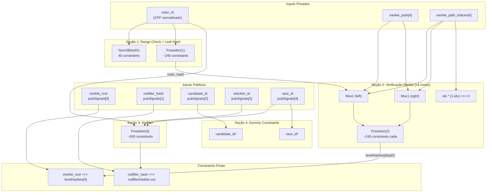
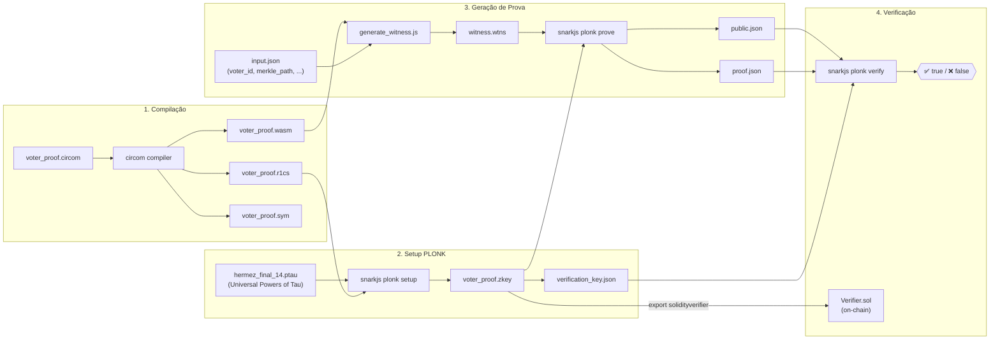
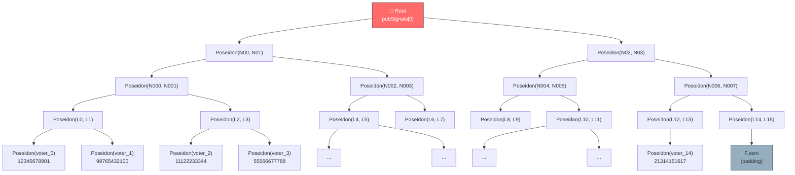
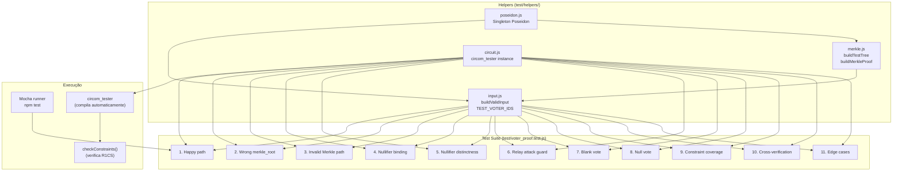
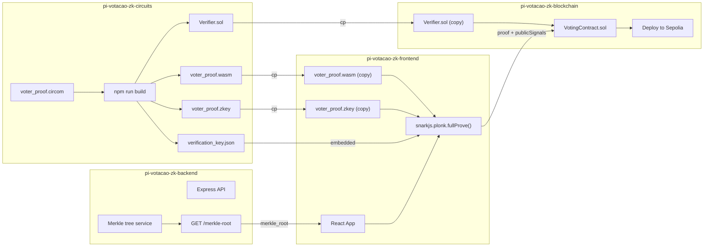

# Diagramas

Diagramas Mermaid da arquitetura do projeto `pi-votacao-zk-circuits`.

---

## 1. Fluxo de sinais do circuito

---

## 2. Workflow PLONK (compilação → verificação)

---

## 3. Estrutura da Merkle Tree (depth=4)

---

## 4. Infraestrutura de testes

---

## 5. Fluxo de artefatos cross-repositório

